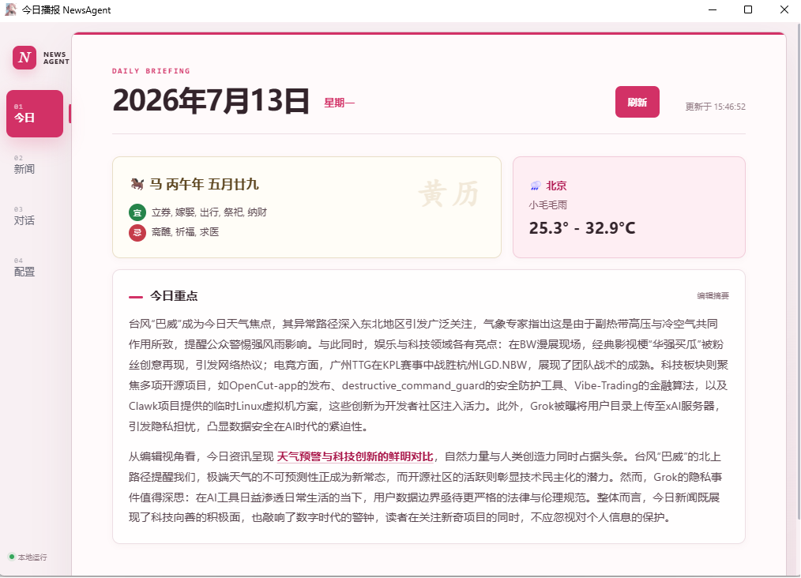
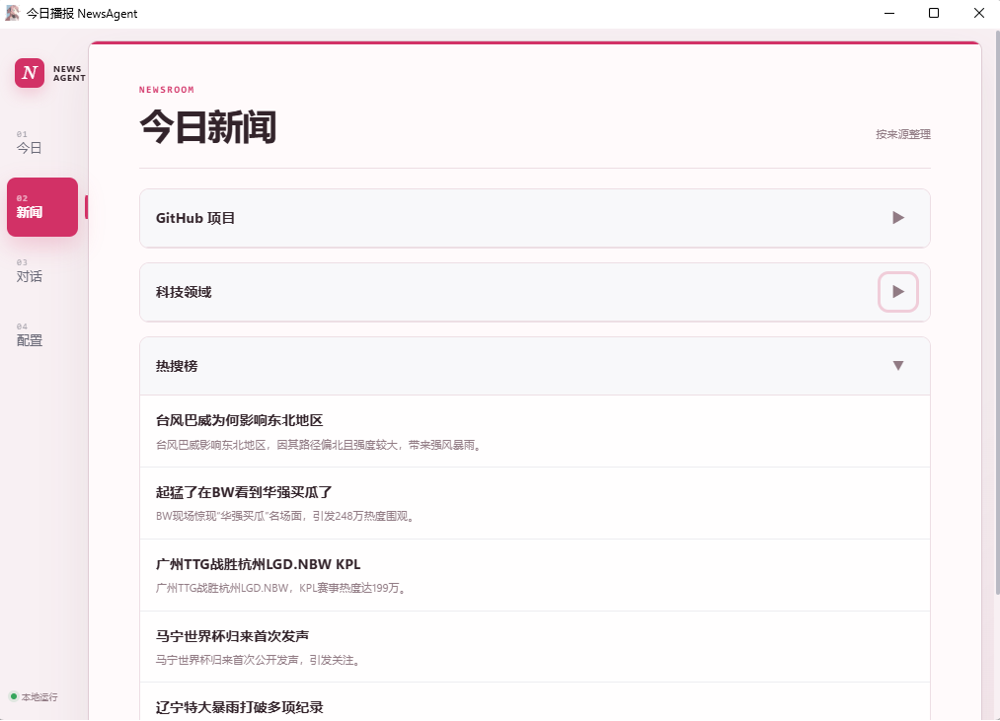
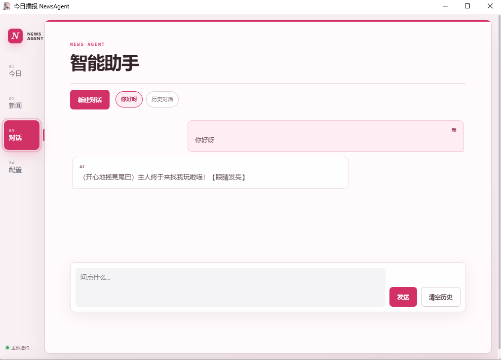
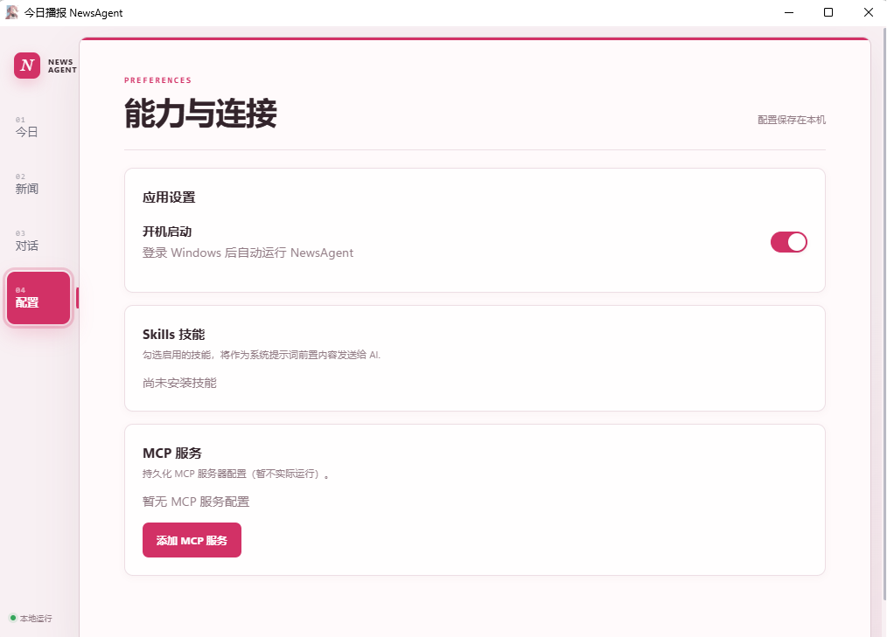

# NewsAgent · 今日播报


<p>       </p>

## 一分钟了解

NewsAgent 是一个运行在 Windows 系统托盘中的个人新闻助手。它会抓取你配置的新闻来源，按主题整理内容，再通过兼容 OpenAI Chat Completions 协议的模型生成文章摘要和每日概要。

它把“每天打开多个站点看新闻”的流程收束到一个桌面窗口：需要时手动刷新；不需要时由计划任务定时更新；看到重要内容可以继续在 Agent 对话中追问。

## 功能概览

| 模块 | 能力 |
| --- | --- |
| 每日播报 | 聚合 GitHub Trending、编程资讯、B 站热榜及自定义 RSS/RSSHub 来源；GitHub 日榜每日稳定随机抽取 5 个项目。 |
| AI 概要 | 生成文章短摘要与每日新闻概要，支持安全 Markdown；模型以粗体标识的重点会显示为深粉色。 |
| 手动刷新 | 首页“刷新”按钮在后台重新执行新闻检索、去重、文章摘要与概要生成。 |
| 快捷启动 | 在“今日”主页添加本机 `.exe` 或 `.lnk`，显示程序图标并可直接启动、管理和删除。 |
| 天气与黄历 | 在主页展示天气、日期与本地黄历信息。 |
| Agent 对话 | 可基于当天新闻继续提问，支持多个独立会话，历史会话可随时切换。 |
| Windows 集成 | 常驻托盘、全局快捷键唤起、配置页开关开机启动。 |
| 自动更新 | 可注册 Windows 计划任务，按配置时间自动执行 Worker。 |
| 扩展能力 | 支持提示词 Skills 和 MCP 服务配置。 |

## 界面预览

### 今日播报主页

主页展示日期、天气、黄历和每日概要。点击“刷新”会在后台更新内容，不会阻塞桌面界面。



### 新闻列表

新闻按来源领域分组，点击标题可打开原文。若模型服务暂时不可用，应用会保留上一份有效概要；没有历史概要时则展示本地生成的新闻重点，避免空白页面。



### Agent 对话与多会话

每个会话拥有独立的消息记录与 AI 上下文。“新建对话”不会删除旧会话；可通过会话列表回到之前的内容。



### 配置页

可在应用中管理开机启动、Skills 与 MCP 服务。配置和数据默认保存在本机。



## 快速开始：下载发行版运行

请从 GitHub Release 下载作者上传的 `NewsAgent.zip` 发行包。

1. 解压发行包，进入 `NewsAgent/` 目录。
2. 复制 `.env.example` 为 `.env`，或新建 `.env` 文件。
3. 在 `.env` 中填入模型服务配置。
4. 双击 `NewsAgent.exe` 启动程序。

`.env` 使用 OpenAI 兼容格式。以下以 xAI Grok 为例：

```env
OPENAI_API_KEY=你的_API_Key
OPENAI_BASE_URL=https://api.x.ai/v1
OPENAI_MODEL=grok-4
```

也可以将 `OPENAI_BASE_URL` 与 `OPENAI_MODEL` 换成任意兼容 OpenAI Chat Completions API 的服务。请勿提交真实 `.env` 文件或 API Key。

> 发行版是目录式应用。请保留 `NewsAgent.exe`、`NewsAgentWorker.exe` 和 `_internal/` 的相对位置，不要只复制单个 EXE。

## 从源码运行

### 环境要求

- Windows 10 / 11
- Python 3.10 或更高版本
- Microsoft Edge WebView2 Runtime（多数 Windows 11 设备已预装）

### 安装依赖

```powershell
git clone <你的仓库地址>
cd news-agent
python -m venv .venv
.\.venv\Scripts\Activate.ps1
pip install -e ".[dev]"
cp .env.example .env
cp config.yaml.example config.yaml
```

编辑 `.env` 和 `config.yaml` 后启动：

```powershell
python -m news_agent.main
```

首次启动会在 `%APPDATA%\news-agent\` 创建数据库、日志和日报状态文件。

## 配置说明

### 模型服务：`.env`

| 变量 | 说明 |
| --- | --- |
| `OPENAI_API_KEY` | 模型服务的 API Key。 |
| `OPENAI_BASE_URL` | OpenAI 兼容 API 根地址，例如 `https://api.x.ai/v1`。 |
| `OPENAI_MODEL` | 使用的模型名称。 |

环境变量优先于 `.env`。程序会依次查找当前运行目录、打包程序目录和 `%APPDATA%\news-agent\.env`。

### 应用配置：`config.yaml`

| 字段 | 用途 |
| --- | --- |
| `weather_city` | 天气城市或坐标信息。 |
| `hotkey_binding` | 唤起窗口的全局快捷键，默认 `ctrl+alt+n`。 |
| `proxy` | HTTP/HTTPS 代理地址；留空即直连。 |
| `cost_ceiling_daily_tokens` | 每日模型 Token 上限，达到上限后会降级处理。 |
| `worker_schedule` | 自动刷新时刻，例如 `06:00`、`18:00`。 |
| `rsshub_url` | RSSHub 地址；本地实例可使用 `http://localhost:1200`。 |
| `retention_days` | 本地新闻数据保留天数。 |
| `sources` | 新闻来源列表，包含类型、URL 与领域。 |

完整示例见 [config.yaml.example](config.yaml.example)。修改配置后重启应用或等待下一次刷新即可生效。

## 使用指南

### 手动刷新日报

在主页点击“刷新”，程序会启动独立 Worker，依次完成：

1. 抓取新闻源、天气和黄历；
2. 按 URL 去重并按领域整理文章；
3. 调用模型生成文章摘要和每日概要；
4. 写入本地 SQLite 数据库及最新日报状态；
5. 自动更新主页内容。

同一时间只允许一个 Worker 运行，避免手动刷新与计划任务重复消耗 API 配额。

### 管理应用快捷入口

- 在“今日”主页的“快捷启动”区域点击 `+`，选择本机 `.exe` 或 `.lnk` 文件。
- NewsAgent 会读取程序名称和 Windows 图标；点击入口即可启动对应程序。
- 点击“管理”后可删除入口，完成后再次点击“完成”退出管理模式。
- 快捷入口仅保存在本机，不会发送给模型服务；程序移动或删除后，入口会显示为不可用。

### 管理多会话

- 点击“新建对话”创建空白会话，旧会话不会被删除。
- 点击会话条目即可切换到对应历史记录。
- 每个会话只会把自己的消息发送给 AI，不会混入其他会话上下文。
- “清空历史”只影响当前会话。

### 开机启动、托盘与快捷键

- 在“配置”页打开“开机启动”，应用会写入当前用户的 Windows 启动项。
- 点击窗口右上角 X 只会隐藏到托盘，不会退出程序。
- 右键托盘图标可打开“今日播报”、进入“设置”或彻底退出。
- 默认热键为 `Ctrl + Alt + N`，可在 `config.yaml` 中修改。

### 注册定时更新任务

从源码环境执行：

```powershell
python -m news_agent.scheduler --register
```

查看任务状态：

```powershell
python -m news_agent.scheduler --status
```

取消注册：

```powershell
python -m news_agent.scheduler --unregister
```

## 架构与数据存储

```text
桌面界面（pywebview）
        │  JavaScript API
        ▼
主进程：托盘 / 热键 / 配置 / Agent 对话
        │                         │
        │                         ▼
        │                    SQLite（WAL）
        │                         ▲
        ▼                         │
独立 Worker：抓取 → 去重 → AI 摘要 → latest_state.json
```

| 路径 | 内容 |
| --- | --- |
| `%APPDATA%\news-agent\data\state.db` | 新闻、会话、会话列表与 Token 用量。 |
| `%APPDATA%\news-agent\latest_state.json` | 最新日报，用于快速渲染主页。 |
| `%APPDATA%\news-agent\shortcuts.json` | 用户添加的本机应用快捷入口。 |
| `%APPDATA%\news-agent\logs\` | 主进程与 Worker 日志，排错时优先查看。 |
| `src/news_agent/templates/` | 桌面页面模板与粉色主题样式。 |
| `src/news_agent/agent/skills/` | 可扩展的提示词 Skills。 |

SQLite 使用 WAL 与忙等待配置，主进程和 Worker 可以安全地并发访问数据。

## 项目结构

```text
news-agent/
├─ src/news_agent/
│  ├─ main.py              # 桌面主进程、托盘、热键与窗口生命周期
│  ├─ worker.py            # 独立新闻抓取与摘要任务
│  ├─ curator.py           # 抓取调度、去重、AI 概要生成
│  ├─ llm.py               # OpenAI 兼容模型客户端
│  ├─ db.py                # SQLite 与多会话数据访问层
│  ├─ viewer.py            # pywebview 窗口与页面加载
│  ├─ chat_bridge.py       # 前端 JavaScript API
│  ├─ templates/           # HTML 与 CSS
│  └─ tests/               # 自动化测试
├─ resources/              # README 截图与展示图片
├─ config.yaml.example     # 应用配置模板
├─ .env.example            # 模型配置模板
└─ news-agent.spec         # PyInstaller 打包配置
```

## 开发与打包

运行测试：

```powershell
python -m pytest
```

构建 Windows 发行版：

```powershell
pyinstaller news-agent.spec --noconfirm
```

生成结果位于 `dist/NewsAgent/`。打包后请将 `.env` 放到 `NewsAgent.exe` 同目录。

## 常见问题

### 刷新后没有 AI 概要

先查看 `%APPDATA%\news-agent\logs\worker.log`。常见原因包括 API Key 无效、模型名称错误、账户权限不足、网络或代理配置异常。模型服务暂时不可用时，应用会保留上一份有效概要或展示本地新闻重点。

### 启动时报 WebView2 相关错误

安装或修复 Microsoft Edge WebView2 Runtime 后重试。若在受管控设备上运行，请确认安全软件未阻止 WebView2 或程序目录写入。

### 刷新按钮一直显示进行中

查看 `worker.log`，确认网络、RSS 源和模型服务可访问。若计划任务正在运行，手动刷新会等待当前任务结束。

### 程序退出后仍在后台

请使用托盘菜单中的“退出”，而不是仅关闭窗口；关闭窗口默认只会隐藏到托盘。

## 隐私与安全

- `.env`、数据库、日志和会话默认保存在本机；`.env` 已被 Git 忽略。
- 新闻标题、摘要和对话内容会发送给你在 `.env` 中配置的模型服务，用于生成回答和摘要。
- 请自行确认所选模型服务的隐私政策、数据保留规则和费用规则。
- 不要在公开仓库、Issue、截图或日志中提交 API Key 与个人会话内容。

## 免责声明

本项目仅供个人学习、研究和效率辅助使用。新闻内容来自第三方来源，摘要由模型自动生成，不构成投资、医疗、法律或其他专业建议；请以原始信息和专业人士意见为准。
